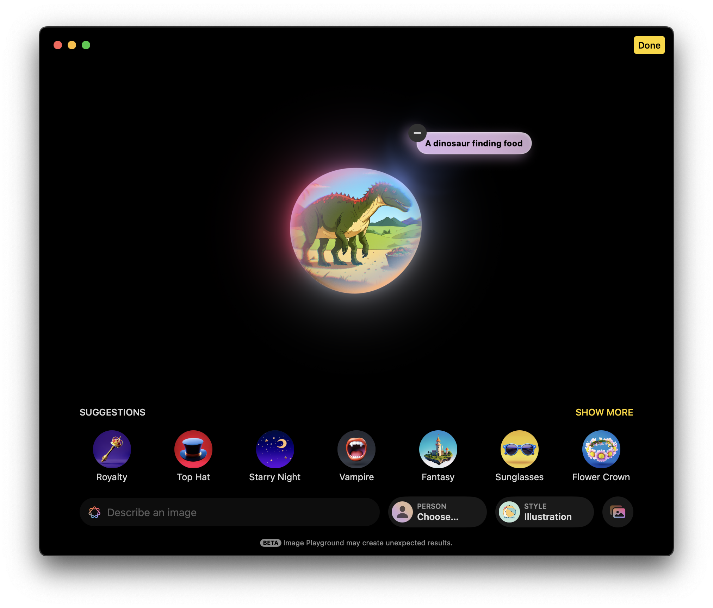
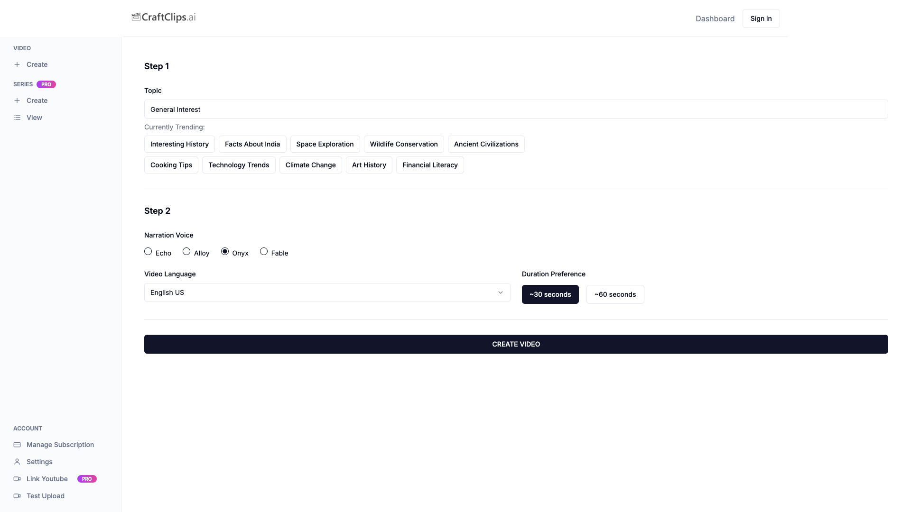
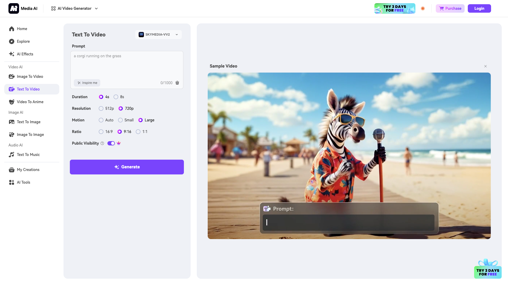
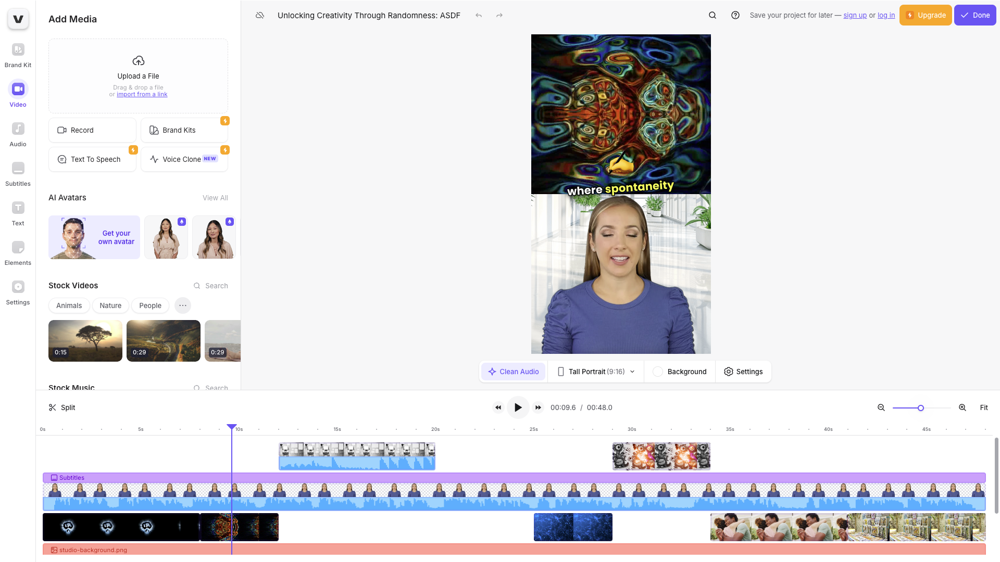
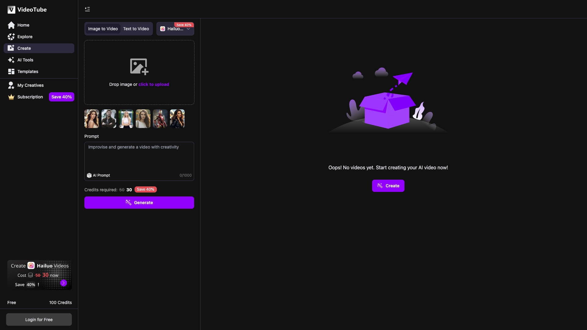

# SimpleVideo: A Text-to-Video Generation Platform
## ECE1724H Advanced Web Development Course Project Proposal

> Grouop members:
>  * Jijun Chi (1010253887)
>  * Winfred Tai (1004932683)

## 1. Motivation

### Problem Statement
In today's digital content creation landscape, video has become the dominant medium for engagement across social media, marketing, and education. Video memes go viru easily on differnet platforms including X, facebook, Instagram and Bilibili. However, creating high-quality, personalized video content remains a significant challenge for many users due to:

- Technical barriers requiring specialized video editing skills
- Time-intensive production processes
- High costs associated with professional video creation
- Limited access to customizable templates that maintain brand consistency

While text-to-image generation has seen rapid adoption, which has already been incoporated in MacOS playgorund application, text-to-video generation remains less accessible to everyday users despite recent technological advancements. Current solutions often require technical expertise, lack user-friendly interfaces, or provide limited customization options.



### Why This Project Matters
SimpleVideo aims to simplify video content creation by leveraging cutting-edge AI technologies through an intuitive web interface. By simplifying the video generation process, we can:

- Empower non-technical users to create engaging video content
- Reduce the time and resources required for video production
- Enable personalization at scale through templates and customization options
- Provide a unified interface to multiple text-to-video services from differnece providers, offering users the best results

###  Target Users
SimpleVideo targets these user segments:

1. **Content Creators & Social Media Managers**: Individuals like Bilibili Ups, youtubers and online influencers who need to regularly produce engaging video content but lack advanced technical skills. SimpleVideo provides them creative ideas as well as contents.
2. **Small Business Owners**: Entrepreneurs seeking cost-effective ways to create marketing videos without hiring production teams. SimpleVideo reduces the cost of marketing for small companies and startups.
3. **Educators**: Teachers and instructors looking to transform educational content into engaging video formats. SimpleVideo helps minoring the education gap through converting words on textbook into multimedia contents that students can easily understand.
4. **Students**: Those working on projects requiring visual presentations but lacking video production expertise. SimpleVideo releases the burden on students and lets them demonstrate their ideas more conveniently.

### Existing Solutions and Limitations
We make a research about the video generation market and try on differnet products. We provide a comprehensive comparation between those products(order by alphabet).

1. Craftclips.ai

   

   Craftclips.ai is a neat and samll website to create videos. It separates video creation into script creating, audio creating, images creating and video creating, followed by a final polishing step to put everything together. It's tiny and easy-to-use, while preserving 2 major fallbacks. Firstly, it lacks visulized examples to guide users how to write prompts and is less attractive to users. Secondly, it doesn't support video customization other than pormpting, lacking support of picture uploads, which is supported by other websites. 

2. Media.ai
   
   

   Media.ai is an inclusive AI tool website that supports video generation, video style transfer, image generation, and audio generation. It also provides a broad range of AI effect templates, allowing users to create videos with custom actions. Media.ai supports both text and image uploads, but it only provides a series of SKYMEDIA generation APIs, which may confuse users about the quality of the generated results.

3. Veed.io

    
  
    Veed.io is a powerful video creating and editing tool. It provides the whole video creating and processing ecosystem, from script generation to video generation. After video generation, it goes into a workspace similar to Canvas(See picture below), which supports video editing in a collebrative environment. While it lets users edit video contents easily, it's not powerful as other video editing tools like Adobe Premiere and CapCut, making this feature unnecessary for most of users. Also, users can only use AI model provided by Veed, which is completely a blackbox and quality can not be guarenteed. Lastly, videos are only stored 24 hours before deleting and users need to download as soon as possible.

4. Videotube.ai
  
    

    Videotube.ai is another video generation website. It provides an extensive amount of templates and video examples with prompts to help users tailor their own prompts. It also supports image and text uploads. The limitation of Videotube.ai is that users cannot select their preferred video settings. For example, 5-second videos are sufficient for many users, while others may want 10-second videos. Better resolution requires more computational resources and improves quality, which is a tradeoff users should be able to weigh on their end.

While platforms like Media.ai have made significant strides in this space, several limitations persist:

- **Service Lock-in**: Most platforms rely on a single text-to-video model, limiting quality and stylistic range
- **Limited Customization**: Insufficient options for personalizing output based on user preferences
- **Poor Integration**: Lack of cohesive workflow with other digital content systems
- **Accessibility Issues**: Complex interfaces that intimidate non-technical users
- **Storage Limitations**: Inadequate long-term storage solutions for generated content

Our project addresses these limitations by creating an open architecture that integrates multiple AI services while prioritizing user experience and practical content management.

## 2. Objective and Key Features

### Project Objectives

Our primary objective is to develop a full-featured text-to-video generation platform that provides an easy-to-use, intuitive and accessible interface for generating high-quality videos from text prompts and images. Our goal is to create a solution that bridges the gap between sophisticated video generation capabilities and everyday users who lack specialized skills but need to create engaging video content. The platform includes the features such as  text-to-video and image-to-video AI services based on multiple models to deliver optimal results; template-based customization for consistent branding and styles; a robust user management system with secure authentication; complete content management solution for storing and organizing generated videos.


### Core Features and Technical Implementation

**1. User Authentication System:** For SimpleVideo, we will implement an authentication system using React on the frontend integrated with modern authentication protocols. Users will be able to register and log in through traditional email/password combinations or through Google's OAuth 2.0 for a streamlined experience. Secure password hashing algorithms (with salt functions) will be implemented to avoid storing user credentials in plaintext that may incur potential rainbow table attacks. We will also integrate Google OAuth 2.0 as many users prefer the convenience of logging in with existing accounts. This apporach eliminates the need for users to remember another set of credentials while providing enhanced security through Google's authentication infrastructure. For session management, we'll implement JSON Web Tokens (JWT), which provides several advantages for our application, including reduced database queries for session validation and better scalability, and role-based access control through JWT claims. 

**2. Interactive Video Generation Interface:** The principle of SimpleVideo will be its intuitive video generation interface built with modern React components. We'll utilize Vite as our build tool for faster development cycles and implement TypeScript to ensure type safety throughout the application. The interface will be styled using Tailwind CSS with shadcn/ui components to create a professional appearance with minimal custom CSS. The interface will focus on the user-friendly design that guides users through the video creation process. Users will be able to drag and drop text elements and visual components to construct their video narratives. A template gallery will also be included where users can browse pre-designed templates with customizable parameters that allows personalization while maintaining professional quality. The image upload functionality will support common file formats and implement client-side validation to ensure compatibility with our video generation services. Users will be able to preview their compositions before actually submitting them for processing, which reduces wasted generation attempts and improves overall user satisfaction.

**3. Multi-Provider AI Integration:** To ensure optimal video generation results, SimpleVideo will implement a flexible backend architecture using Express.js that can interact with multiple text-to-video AI services, most of them will be through API calls from different model providers. This approach allows us to offer users the best possible output though switching different models that  excel in specific styles, contexts, or quality levels. Our backend will create an abstraction layer that standardizes the interface to these diverse AI services, handling the complexity of different API structures and requirements behind the scenes. This multi-provider approach also future-proofs our application, which allows us to easily integrate new text-to-video technologies as they emerge over time. Such flexibility is crucial in the rapidly evolving field of AI-generated content. 

**4. Cloud Storage Integration:** For cloud storage, SimpleVideo will utilize AWS S3 for scalable cloud storage of user-generated videos. This cloud solution is crucial for maintaining high availability of the content, meanwhile, managing costs effectively advandaged by AWS service. AWS S3 provides the durability and availability needed for video content, with built-in redundancy to prevent data loss. The overall storage system will be designed to handle the specific requirements of video content, such as efficient retrieval for streaming playback. Some additional features may include automatic thumbnail generation for video listings, which creates preview images that help users quickly identify and organize their content in the video library. The storage architecture will support tiered access patterns, with frequently accessed videos available for immediate streaming (uploaded images and in-progress generations), while less frequently accessed content may use lower-cost storage options (completed videos with appropriate backup policies). We will NOT implement CDN in SimpleVideo for efficient delivery of video content to users. 

Estimated storage requirements:
- Average video file size: 5-10MB
- Expected initial user base: 100 users
- Average videos per user: 10
- Initial storage requirement: ~5-10GB with scalability planning

### Database Schema and Relationships

The database will be implemented using PostgreSQL:

1. Users Table
    ```sql
    CREATE TABLE users (
      id SERIAL PRIMARY KEY,
      email VARCHAR(255) UNIQUE NOT NULL,
      password_hash VARCHAR(255),
      auth_provider VARCHAR(50) NOT NULL, -- 'local' or 'google'
      created_at TIMESTAMP WITH TIME ZONE DEFAULT CURRENT_TIMESTAMP,
      last_login TIMESTAMP WITH TIME ZONE,
      notification_preferences JSONB,
      default_template_id INTEGER,
      tier VARCHAR(50) DEFAULT 'free',
      storage_used BIGINT DEFAULT 0
    );
    ```

2. Templates Table
    ```sql
    CREATE TABLE templates (
      id SERIAL PRIMARY KEY,
      name VARCHAR(255) NOT NULL,
      description TEXT,
      thumbnail_url VARCHAR(255),
      parameters JSONB, -- Stores parameter configuration
      created_by INTEGER REFERENCES users(id),
      is_public BOOLEAN DEFAULT FALSE,
      created_at TIMESTAMP WITH TIME ZONE DEFAULT CURRENT_TIMESTAMP
    );
    ```

3. Videos Table
    ```sql
    CREATE TABLE videos (
      id SERIAL PRIMARY KEY,
      user_id INTEGER REFERENCES users(id) NOT NULL,
      title VARCHAR(255) NOT NULL,
      description TEXT,
      prompt TEXT NOT NULL,
      template_id INTEGER REFERENCES templates(id),
      parameters JSONB, -- Stores parameter values
      status VARCHAR(50) NOT NULL, -- 'pending', 'processing', 'completed', 'failed'
      processing_service VARCHAR(100),
      storage_url VARCHAR(255),
      thumbnail_url VARCHAR(255),
      created_at TIMESTAMP WITH TIME ZONE DEFAULT CURRENT_TIMESTAMP,
      completed_at TIMESTAMP WITH TIME ZONE,
      file_size BIGINT,
      duration INTEGER,
    );
    ```

4. Processing_Jobs Table
    ```sql
    CREATE TABLE processing_jobs (
      id SERIAL PRIMARY KEY,
      video_id INTEGER REFERENCES videos(id) NOT NULL,
      service VARCHAR(100) NOT NULL,
      status VARCHAR(50) NOT NULL,
      started_at TIMESTAMP WITH TIME ZONE DEFAULT CURRENT_TIMESTAMP,
      completed_at TIMESTAMP WITH TIME ZONE,
      logs TEXT[],
      retry_count INTEGER DEFAULT 0,
      external_job_id VARCHAR(255)
    );
    ```

### User Interface and Experience Design

The UI/UX will follow modern web application principles:

1. Dashboard: Personalized view of the user's video projects and templates
2. Creation Wizard: Step-by-step guided process for video generation
   - Template selection
   - Media upload and customization
   - Generation settings adjustment
3. Video Library: Gallery view with filter and organization tools
4. Template Marketplace: Browse and select from available templates
5. Account Management: User settings, subscription details, and storage usage

Design principles will emphasize:
- Progressive disclosure of complex features
- Responsive design for mobile and desktop use (mainly for desktop users)

### Integration with External Services

The platform will integrate with several external services as mentioned before:

1. Authentication Providers:
   - Google OAuth 2.0

2. Text-to-Video AI Services:
   - Runway ML API
   - Kling API
   - Hailou API
   - PixVerse API
   - Wanx API

3. Cloud Infrastructure:
   - AWS S3 for storage
   - CloudFlare for domain name routing

### Course Requirements Fulfillment

This project fulfills course requirements by implementing:

1. Advanced Frontend Development:
   - **React** framework with server components
   - Modern frontend building tools including Vite, TypeScript, TailwindCSS, SWC and shadcn/ui.
   - Progressive Web App capabilities

2. Backend API Development:
   - RESTful API architecture with **Express.js**
   - Authentication middleware and security best practices
   - Rate limiting and request validation

3. Database Design:
   - Database modeling with **PostgreSQL**
   - Data validation and schema enforcement
   - Indexing strategies for performance

4. Cloud Integration:
   - AWS/Google Cloud deployment
   - CloudFlare integration

5. Modern Development Practices:
   - CI/CD pipeline with GitHub Actions
   - Comprehensive testing strategy
   - Documentation as code

### Project Scope and Feasibility

To ensure feasibility within the course timeframe, we will focus on delivering the following minimum requirements:

1. Implement a minimum viable product (MVP) focusing on core functionality:
   - Basic authentication
   - Single text-to-video provider integration
   - Template-based generation
   - Cloud storage for completed videos
2. Prioritize features based on technical complexity and user value
3. Utilize existing libraries and services where appropriate
4. Create a modular architecture allowing for incremental development
5. Define clear boundaries for the scope of customization options

By carefully managing scope and leveraging team strengths, we believe this project is achievable within the course timeline while still delivering significant technical and user value.

## 3. Tentative Plan

Our two-person team will collaborate to deliver this project, with responsibilities allocated based on technical strengths and learning objectives:

#### Jijun Chi (Frontend & Integration)
- Lead the development of the React frontend application
- Implement the user authentication flows
- Design and develop the video generation interface
- Create responsive UI components using Material UI
- Implement client-side validation and error handling
- Integrate external text-to-video APIs
- Develop template management functionality

#### Winfred Tai (Backend & Infrastructure)
- Develop the Express.js backend API
- Implement the authentication system
- Create the API abstraction layer for text-to-video services
- Design and implement the PostgreSQL database schema
- Set up and configure cloud storage services
- Implement file upload/download functionality
- Develop the video processing pipeline
- Implement security measures for data protection

#### Collaboration Approach
Our team will employ Agile development practices with:
- Weekly sprints with defined deliverables
- Daily standups via Discord
- Shared GitHub repository with branch protection
- Code reviews through pull requests
- Documentation maintained alongside code

This division of responsibilities ensures both team members contribute significantly to the project while allowing for knowledge sharing and collaborative problem-solving. Our approach emphasizes parallel development tracks to maximize productivity within the limited timeframe while maintaining code quality and project cohesion.
